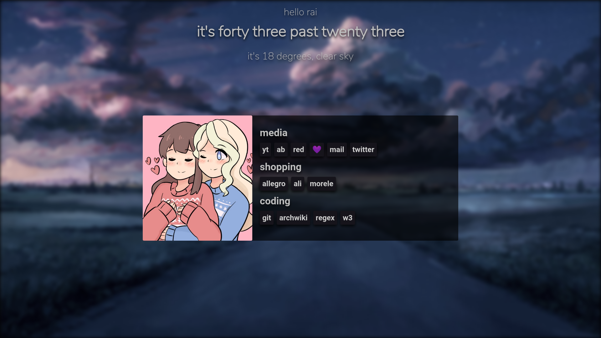

# rai's startpage

this is a startpage i've made for my personal usage inspired by https://github.com/0-l/dawn

it looks like:

for now. i dont know if i'll change much more. feel free to use it for yourself/as a reference! although im not that great at creating websites.

this website is designed for 1080p monitors, as its using pure js, html and css. no libraries.

but, if you have a 768p monitor - i've got good news! there's a style included for those. just change `style.css` with `style-768p.css`.

huge thanks to @Jan200101 and @nopjmp for helping me with this project.

planned: 
- ~~weather~~ change city in js/weather.js to get weather information for your location
- ~~general improvements upon css~~ done? (it never is done)
- ~~background change~~ old ones are still in img/
